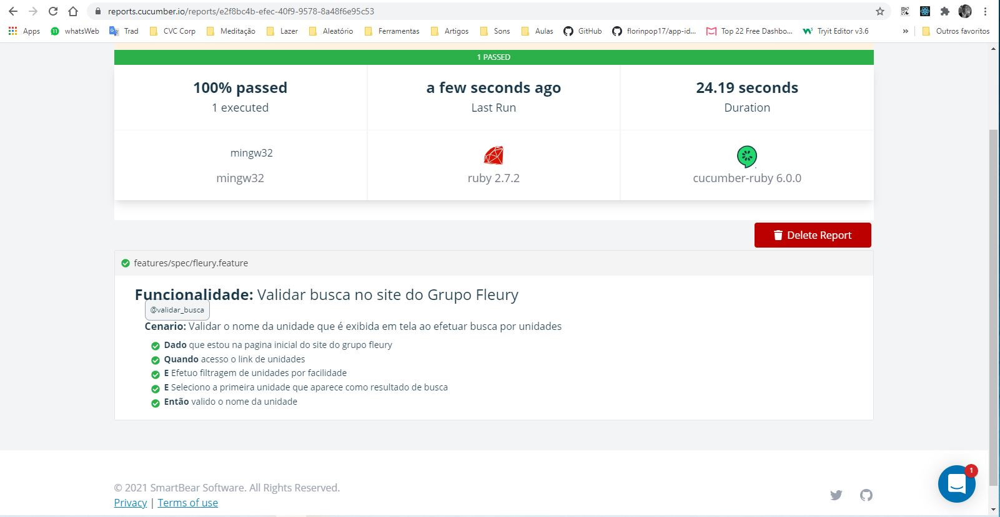
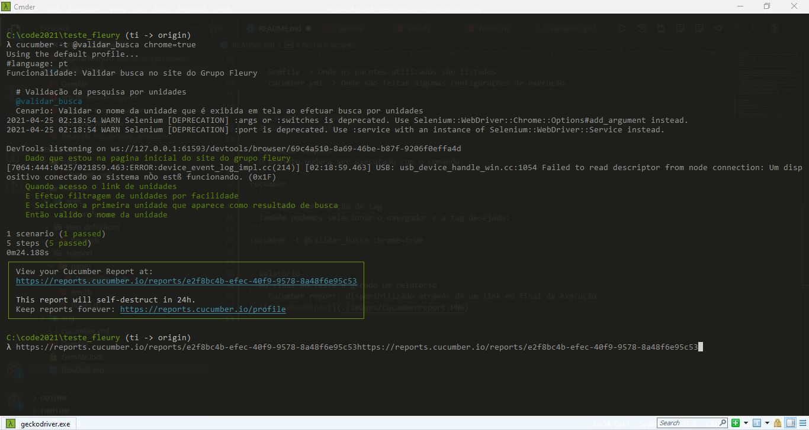

# Sobre o projeto:

Trata-se de uma automação de front-end escrita em ruby, visando validar a funcionalidade de busca no site do Grupo Fleury

Principais pacotes utilizados:

- Capybara

- Cucumber

- Selenium Webdriver


# Estrutura do projeto:

- features -> Aqui é a pasta principal que armazena todas as pastas de funcionalidades.
  - spec -> Fica responsável pelos BDDs.
    - fleury.feature -> Responsavel pelo cenário de testes envolvendo a pagina do Grupo Fleury.

  - step_definitions -> Fica responsável pelos passos (steps) dos BDDs, ligando-os com o código do teste em sí.
      - fleury.rb

  - suport -> Onde os scripts são organizados.
    - pages -> Onde ficam os arquivos de código.
      - PaginaFleury.rb -> Classe e métodos que testam as funcionalidades da pagina.

    - env.rb -> Prepara o ambiente antes da execução dos testes.
    - hooks.rb -> configura ações para antes e depois de cada cenário.

  - data -> Armazena os elementos mapeados.
    - elements.yml -> onde estão mapeados alguns elementos chave, para facilitar a manutenção do código.
      
  - Gemfile -> Onde os pacotes utilizados são listados.
  - cucumber.yml -> Onde são feitas algumas configurações de execução.


  # Rodar o projeto:

> Execução Simples
- O projeto podera ser executado com o comando:
```
cucumber
```
> Execução com seleção de tag
- Também podemos selecionar o navegador e a tag desejada:
```
cucumber -t @validar_busca chrome=true
```

> Relatório
- Ao final do teste é gerado um relatório
  - Cucumber report: disponibilizado através de um link no final da execução
  
  